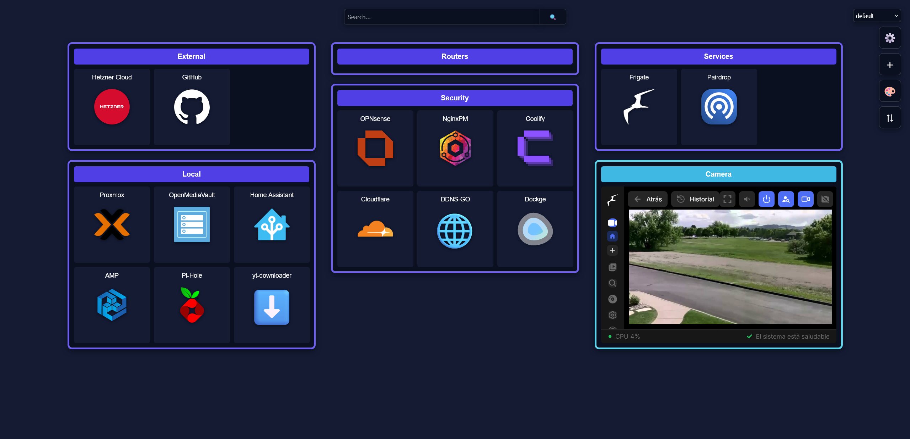

# ⚡ LDash
A (very) lightweight web dashboard to organize and access your self-hosted services from one place.

If you were using Homarr or Dashy but got tired of how heavy and feature-bloated they are,
ldash is for you. No complex setup, no unnecessary dependencies — just a fast dashboard
that gets out of your way. **~30 MB of RAM. Nearly 0% CPU.**

🔗 [Live demo](https://ldash.exofake.com/)



## ✨ Features
- **💾 CSV-based database:** Dead simple and fast file-based setup.
- **🗂️ Profile system:** Switch between profiles with different items.
- **🌈 Color customization:** All dashboard colors are customizable.
- **🔍 Search bar:** Fully customizable search endpoint.
- **🖼️ Widgets:** Technically just iframes, but hey, they work!
- **⇅ Drag-and-drop:** Organize items easily.
- **📍 Status checks:** Checks every 5 minutes each service state (item's url).

### Coming Soon
<<<<<<< HEAD
- Keyboard shortcuts *(actually there's already one — press `C` to open the item creation menu)*
=======
- Keyboard shortcuts (Actually, there is one, pressing "C" key opens the creation item menu.)
>>>>>>> 3ddba0e45360d940359a75775f26c6f25d071104

## 🚀 Installation

### 🐋 Docker (recommended)
```bash
# Download the compose file
curl -O https://raw.githubusercontent.com/AlbertoMolt/ldash/main/docker-compose.yaml
# RUN IT!
docker-compose up -d
```

#### Compose file:
```yaml
version: '3.8'
services:
  ldash:
    image: albertomoltrasio/ldash:latest
    container_name: ldash
    ports:
      - "6780:6780" # <- Port forward
    volumes:
      - ./data:/app/data  # <- DB bind mount
    restart: unless-stopped
```

### 🐍 Native installation (if you're that kind of nerd)
```bash
git clone https://github.com/AlbertoMolt/ldash
cd ldash
pip install -r requirements.txt
python app.py
```
Open your browser at [http://localhost:6780](http://localhost:6780)

## ⚙️ Configuration

### 💾 Database
Items are configured in the `database.csv` file inside the `data/` folder:
```csv
id,name,item_type,icon,url,category,tab_type,profile
1,Portainer,item,https://icon.png,http://localhost:9000,Local,true,default
2,Jellyfin,item,https://icon.png,http://localhost:8096,Local,true,default
3,Frigate,iframe,,https://localhost:5000,,,default
```

### 🌐 Network
<<<<<<< HEAD
Default port is `6780`. You can change it in the `docker-compose.yaml` (Docker) or in `config.json` (native).
=======
The default port is `6780`.

In the docker container case, you can change it in the `docker-compose.yaml` file.

In the native installation case, there is a `config.json` file where you can change the port.
>>>>>>> 3ddba0e45360d940359a75775f26c6f25d071104

## ⚠️ Project status
Functional but very much a work in progress. See [TODO.md](TODO.md) for pending improvements.